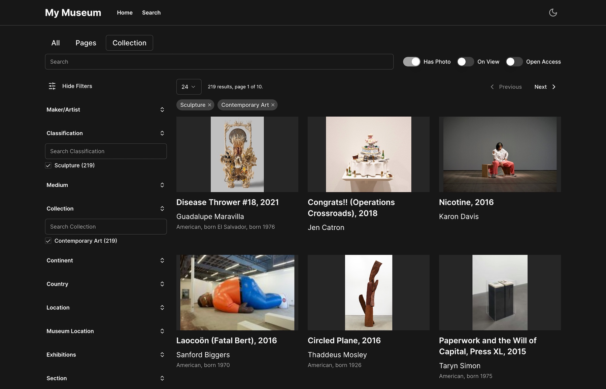

# museum-nextjs-search

Powerful platforms like [Elasticsearch](https://www.elastic.co/) & [Next.js](https://nextjs.org/) make it possible for museums to easily build performant, responsive and accessible faceted searches for their online collections.

## Demo

This project has been deployed on Vercel at https://bkm-next-search.vercel.app/ or https://museum-nextjs-search.vercel.app/
However, my Elasticsearch trial is running out and the demo will probably be dead by the time you read this.

## Dataset

All data was collected via the [Brooklyn Museum Open API](https://www.brooklynmuseum.org/opencollection/api/docs).

## Next.js template

Based on https://github.com/shadcn/next-template ([Website](https://template.shadcn.com/), [UI Components](https://ui.shadcn.com/)),
which is an implementation of [Radix UI](https://www.radix-ui.com/) with [Tailwind](https://tailwindcss.com/) and other helpful utilities.

## Features

- Full-text search, including accession number
- API Endpoints for search & document retrieval
- Searchable filters
- Linked object properties
- Custom similarity algorithm with combined weighted terms (can be adjusted)
- Histogram similarity using Lab color space.
- Embedded JSON-LD (Schema.org [VisualArtwork](https://schema.org/VisualArtwork)) for better SEO and sharing
- Image Zoom with [Openseadragon](https://openseadragon.github.io/)
- Image carousel with [embla-carousel](https://www.embla-carousel.com/get-started/react/)
- Form handling via [Formspree](https://formspree.io/)
- Meta & OG meta tags
- [lucide-react icons](https://github.com/lucide-icons/lucide)
- [Tailwind CSS](https://tailwindcss.com/)
- [next-themes](https://github.com/pacocoursey/next-themes) dark/light modes
- [@next/font](https://nextjs.org/docs/api-reference/next/font) font loading

## Adopt it yourself

It's hoped that all one will need to do is be able to export TMS data to JSON matching the format of the Elasticsearch index.

## API Endpoints

### Search API

Searches can be performed against any index. Search requests are of the form:
GET `http://localhost:3000/api/search/[index]?[querystring]`

Querystring parameters are the same as those for the Web UI:
GET `http://localhost:3000/api/search/collections?f=true&primaryConstituent=George%20Bradford%20Brainerd`

### Document API

Document requests are of the form:
GET `http://localhost:3000/api/[index]/[documentId]`

For example, to get collection object #53453:
GET `http://localhost:3000/api/collections/53453`

## Installation & Running

### Set up Elasticsearch

You can run Elasticsearch in a Docker container, or sign up for an Elasticsearch Cloud account. [For Docker, follow the instructions here.](https://www.elastic.co/guide/en/elasticsearch/reference/8.6/docker.html) [Sign up for an Elasticsearch Cloud account here.](https://cloud.elastic.co/)

### Environment Variables

Once you have a running Elasticsearch service, you can add the connection details to the environment variables.

For local development, add a local `.env.local` file in the root directory. If `ELASTICSEARCH_USE_CLOUD` is "true", the Elastic Cloud vars will be used, otherwise the \_HOST, \_PROTOCOL, \_PORT, \_CA_FILE, and \_API_KEY vars will be used. You may need to copy the http_ca.crt from the Elasticsearch Docker container to a local directory like `./secrets`.

On [Formspree](https://formspree.io/) you should set up a basic contact form and enter the `FORMSPREE_FORM_ID` env variable.

For cloud deployments (for example on Vercel), add the same variables to the Environment Variables of your deployment.

```
ELASTICSEARCH_USE_CLOUD=true
ELASTICSEARCH_CLOUD_ID=elastic-brooklyn-museum:dXMtY2VudlasfdkjfdwLmNsb3VkLmVzLmlvOjQ0MyQ5ZDhiNWQ2NDM0NTA0ODgwadslfjk;ldfksjfdlNmE2M2IwMmaslfkjfdlksj2ZTU5MzZmMg==
ELASTICSEARCH_CLOUD_USERNAME=elastic
ELASTICSEARCH_CLOUD_PASSWORD=aslflsafdkjlkjslakdfj
ELASTICSEARCH_HOST=localhost
ELASTICSEARCH_PROTOCOL=https
ELASTICSEARCH_PORT=9200
ELASTICSEARCH_CA_FILE=./secrets/http_ca.crt
ELASTICSEARCH_API_KEY=DssaSLfdsFKJidsljfakslfjfLIJEWLiMkJPQzNwSzVmQQ==
FORMSPREE_FORM_ID=mskbksar
```

### Download & Install

Fork/download this project and run `npm i` to install dependencies.

Then, run the development server with `npm run dev` and open http://localhost:3000 with your browser to see the result.

If you have not yet loaded the Elasticsearch data, you should see an error on the search page that the index does not exist.

### Loading the data

The main data file with collection objects is `./data/BkM/json/collections.jsonl`. It has been gzipped to fit into github. Just run `gunzip collections.jsonl.gz` to decompress it.

`importDataCommand.ts` will load data from .jsonl files in the `data/BkM/json/` directory into Elasticsearch indices. **_Warning: This will erase Elasticsearch indices._**

From the command line, run:

```
npx ts-node --compiler-options {\"module\":\"CommonJS\"} ./util/data/import/importDataCommand.ts
```

The import process will take some time, as it inserts 100 documents at a time using Elasticsearch bulk and then rests for a couple seconds. It is currently set to use the sample dataset, edit `./util/data/dataFiles.ts` to use the full dataset. There are about 10,000 documents in the sample dataset and 100,000 documents in the default dataset.

## License

Licensed under the [MIT license](https://github.com/shadcn/ui/blob/main/LICENSE.md).

## Screenshots

Light mode example:


Dark mode example:



Object page example:


